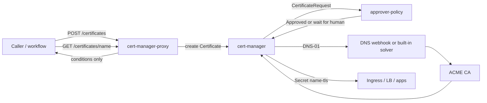
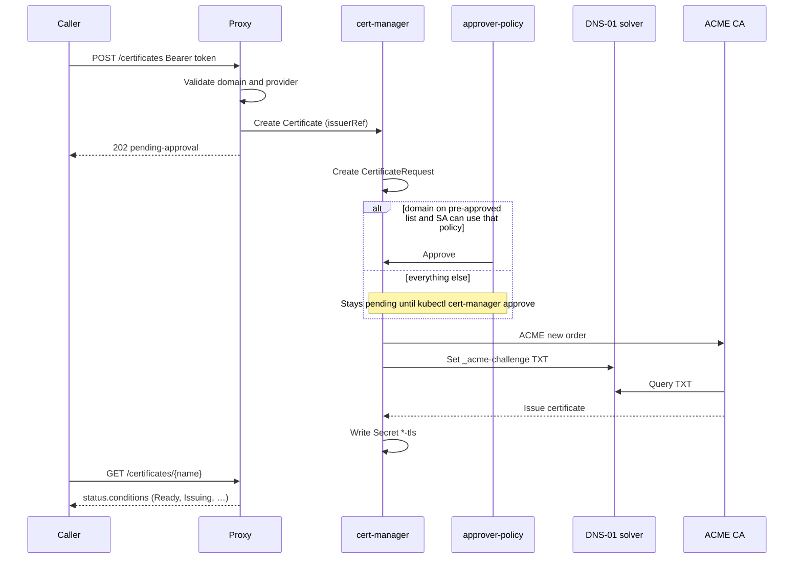
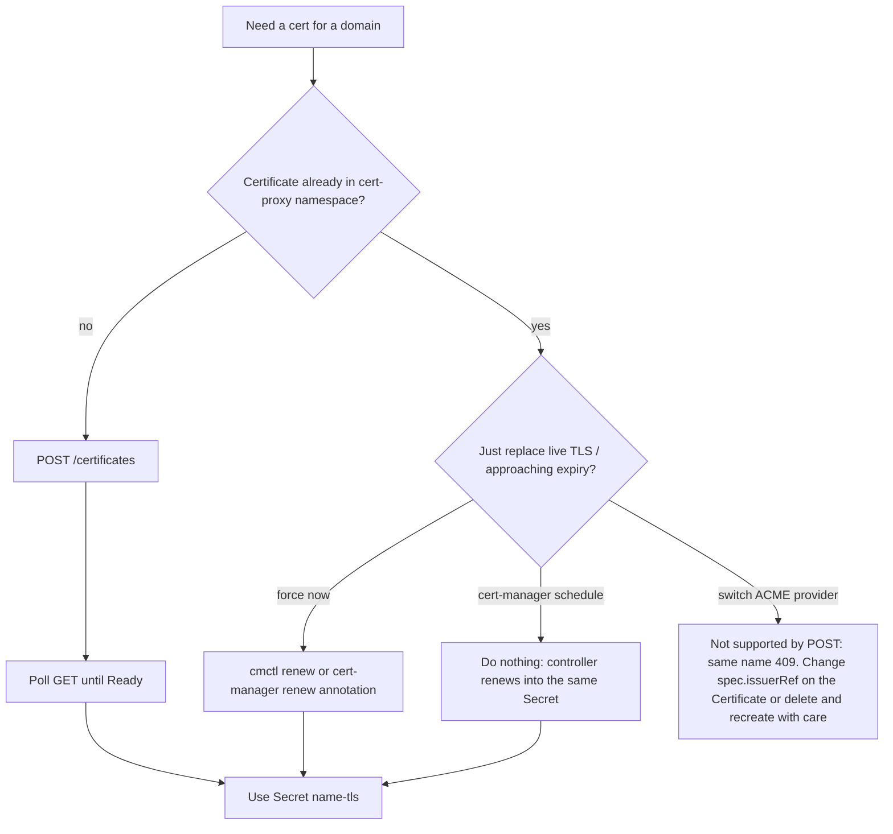

# cert-manager-proxy

[](/../../issues)
[](/LICENSE)
[](https://github.com/bcgov/repomountie/blob/master/doc/lifecycle-badges.md)
[](https://codecov.io/gh/bcgov/cert-manager-proxy)

> **Experimental.** Untested against a real cluster. Do not deploy as-is.

A thin intake API in front of [cert-manager](https://cert-manager.io/) that
lets you request certificates from multiple ACME providers (DNS-01 only)
behind an out-of-band pre-approval gate.

**In one sentence:** this service **starts** a cert. cert-manager **keeps** it
renewed. Your app reads the Kubernetes Secret. This API never talks to Let's
Encrypt (or ZeroSSL, or Entrust) itself.

## Plain language

HTTPS needs a certificate. A CA (Let's Encrypt, etc.) only issues one after
you prove you own the domain — here, by putting a special DNS record up.

This repo is a **receptionist**. You say “I want a cert for
`app.example.com` from Let's Encrypt.” It writes that down as a Kubernetes
`Certificate` and stops. **cert-manager** (already in the cluster) proves
DNS, talks to the CA, and puts `tls.crt` / `tls.key` in a Secret named
`app-example-com-tls`. Point Ingress / a load balancer / your app at **that
Secret**.

A **bouncer** ([approver-policy](https://github.com/cert-manager/approver-policy))
sits in front of the CA call. If the domain is on the pre-approved list, it
waves through. If not, a human must `kubectl cert-manager approve`. Until
then, nothing is issued.

**First time** (or replacing a cert you got some other way): POST once, wait
until Ready, swap your site over to the new Secret. You do not upload old
PEMs — you get a **new** cert and **swap**.

**Later (rollover):** do nothing. cert-manager overwrites the same Secret
before expiry. POST again for the same domain is `409` — the ticket already
exists. To force a rotation now: `cmctl renew`, not a second POST.

## What lives where

| Piece | Role |
| --- | --- |
| This Go API | Auth, validate `{domain, provider}`, create/get `Certificate` objects |
| Helmfile + this chart | Helmfile installs cert-manager, then `approver-policy`, then this chart (API + `ClusterIssuer`s + `CertificateRequestPolicy`s). The chart does not install cert-manager. |
| `approver-policy` | Pre-approval gate. cert-manager will not start ACME until the `CertificateRequest` is `Approved` |
| cert-manager | ACME DNS-01, writes the TLS Secret, renews before expiry |
| Your DNS webhook | Implements DNS-01 for an internal/custom DNS API (or use a built-in solver: Route53, Cloudflare, …) |

The API's ServiceAccount can `create`/`get` `Certificate`s only. It cannot
read the TLS Secret. Callers poll `GET /certificates/{name}` for conditions;
operators (or another controller) consume `{name}-tls`.

`ClusterIssuer`s and `CertificateRequestPolicy`s are templated from Helm
values — see `charts/cert-manager-proxy/values-example.yaml`.





## First issuance (obtain)

Domain review happens **before** or **beside** this API, not inside it.

1. Put allowlisted names in `policies.preApprovedDomains.dnsNames` (Helm
   values), **or** leave them off the list so a human in
   `policies.manualReview.reviewerGroup` must `kubectl cert-manager approve`.
2. `POST /certificates` with `{"domain":"app.example.com","provider":"letsencrypt"}`
   and `Authorization: Bearer …`.
3. The proxy maps `provider` → `ClusterIssuer` name, sanitizes the domain
   into a Kubernetes object name (`app.example.com` → `app-example-com`,
   `*.example.com` → `wildcard-example-com`), and creates a `Certificate`.
4. Response is `202 Accepted` with `status: pending-approval`. A second POST
   for the same domain is `409 Conflict` — renewal is not a new POST (see
   [Rollover](#rollover-renewal)).
5. cert-manager creates a `CertificateRequest`. If the requestor's SA has
   `use` on `pre-approved-domains` **and** the DNS names match that policy,
   `approver-policy` auto-approves. Otherwise it waits for a reviewer.
6. After approval, cert-manager runs ACME DNS-01, then writes Secret
   `app-example-com-tls`.
7. Point Ingress, a load balancer, or `kubectl get secret` at that Secret.

## Rollover (renewal)

Once a `Certificate` exists, **cert-manager owns rollover**. Default ACME
certs are ~90 days; cert-manager renews at about **2/3 of the lifetime**
(around 30 days before expiry). This API does not set `spec.duration` /
`spec.renewBefore`, so you get those defaults.

Renewal reuses the same `Certificate`, issuer, and Secret name. A new
`CertificateRequest` still goes through `approver-policy`. Names on
`pre-approved-domains` auto-approve; names that only match `manual-review`
need a human again unless you add them to the allowlist.

Do **not** POST again to renew. The name is derived from the domain, so
create fails (`409` from this API).

Force a rotation (compromise, “issue now”):

```sh
cmctl renew app-example-com -n cert-proxy
```

Or annotate the `Certificate` as in [cert-manager renewal](https://cert-manager.io/docs/usage/certificate/#renewal).
The Secret is updated in place.



## Migrating an existing (non–cert-manager) certificate

This stack always **issues a new** ACME certificate. It does not upload an
existing PEM.

1. Confirm the name is allowlisted or that a reviewer will approve.
2. POST once; wait until `Ready`.
3. Copy or reference Secret `{sanitized-domain}-tls` where the old cert is
   installed.
4. Leave the `Certificate` in place so cert-manager keeps rolling it over.

Until the Secret is Ready, keep serving the old cert.

## Provider names vs ClusterIssuers

The HTTP `provider` field is a short alias in Go
(`internal/certrequest/certrequest.go`), not the Helm `issuers[].name`:

| `provider` in JSON | `ClusterIssuer` |
| --- | --- |
| `letsencrypt` | `letsencrypt-prod` |
| `zerossl` | `zerossl-prod` |

Helm `values-example.yaml` also templates an `entrust-prod` issuer. The API
will reject `"provider":"entrust"` until that alias is added to the Go map.
Adding a `ClusterIssuer` in values is not enough by itself.

## Approval RBAC (why `disableAutoApproval` exists)

`helmfile.yaml` sets `disableAutoApproval: true` on the cert-manager
release. Without that, cert-manager's built-in approver would approve
every `CertificateRequest` and the policies would never gate issuance.

- Proxy SA: `use` on policy `pre-approved-domains` only.
- Reviewer group: `use` on policy `manual-review` (optional; off until you
  set a real SSO group).

## Build & test

```sh
go build ./...
go test ./...
```

## Deploying to a cluster

`helmfile.yaml` brings up the whole stack with one command: cert-manager,
then `approver-policy`, then this repo's own chart
(`charts/cert-manager-proxy`) with your `ClusterIssuer`s/
`CertificateRequestPolicy`s templated from values. Each is a genuinely
separate Helm release, applied in dependency order with `wait: true`
between them — not a workaround, just no same-release CRD-registration
race to begin with (a single chart that both installs a CRD *and* creates
instances of it hits exactly that race; confirmed against a real cluster
in `test/integration`, which is also why this repo isn't structured that
way).

```sh
brew install helmfile   # or see https://helmfile.readthedocs.io

export CERT_PROXY_TOKEN=s3cret   # or use auth.existingSecretName in values-example.yaml for anything real
helmfile sync
```

`helmfile.yaml` sets `disableAutoApproval=true` on the cert-manager
release — without that, cert-manager's built-in approver auto-approves
every `CertificateRequest` and the whole pre-approval gate this repo
exists for does nothing. See `charts/cert-manager-proxy/values.yaml` for
the rest of this chart's own knobs (image, replica count, resources,
existing-secret auth).

Don't want another CLI dependency? `charts/cert-manager-proxy` also works
as a plain Helm chart — install cert-manager and approver-policy yourself
first (see `helmfile.yaml` for the exact chart refs/versions/values this
repo uses), then:

```sh
helm install cert-manager-proxy charts/cert-manager-proxy \
  --namespace cert-proxy --create-namespace \
  --values charts/cert-manager-proxy/values-example.yaml \
  --set auth.token=s3cret
```

That's one command too — this chart no longer bundles cert-manager/
approver-policy as dependencies, so as long as they're already installed
(from a prior, separate release) there's no CRD-timing race for this
chart's own `helm install` to hit.

`issuers[].dns01` in values is passed straight through to cert-manager's
DNS-01 solver, so any provider it supports works — a built-in one
(Route53, Cloudflare, Azure DNS, Google CloudDNS) or, for an internal/
custom DNS system, cert-manager's
[webhook solver](https://cert-manager.io/docs/configuration/acme/dns01/webhook/)
([scaffold](https://github.com/cert-manager/webhook-example)), which is
what `values-example.yaml` demonstrates — see
[cert-manager's DNS-01 docs](https://cert-manager.io/docs/configuration/acme/dns01/)
for each built-in provider's shape. The webhook itself is a separate
service you write and deploy; cert-manager just calls it.

The real secret material any of this needs (account keys, an EAB HMAC key,
your DNS provider's API credentials) is never put in values — it's
created as a Kubernetes Secret out of band and referenced by name/key,
e.g.:

```sh
kubectl create secret generic internal-dns-credentials \
  --namespace cert-proxy \
  --from-literal=api-key=<your DNS provider's API key>
```

## Run locally

Requires a kubeconfig (or in-cluster config) with access to a cluster that
has cert-manager and `approver-policy` installed (see Deploying above).

`CERT_PROXY_TOKEN` is required — the server refuses to start without it.
It's a single shared bearer token, fine for one trusted caller; see the
`ponytail:` comment on `requireBearerToken` in `main.go` for the upgrade
path (Kubernetes TokenReview/SubjectAccessReview, or a kube-rbac-proxy
sidecar) once there are multiple callers needing distinct identities.

```sh
CERT_PROXY_TOKEN=s3cret go run ./cmd/cert-manager-proxy
```

```sh
curl -X POST localhost:8080/certificates \
  -H "Authorization: Bearer s3cret" \
  -d '{"domain":"app.example.com","provider":"letsencrypt"}'

curl -H "Authorization: Bearer s3cret" localhost:8080/certificates/app-example-com
```

## Not done yet

- CI to build and push the container image (`Dockerfile` exists but nothing
  publishes it to `ghcr.io/bcgov/cert-manager-proxy` yet, so the chart's
  default `image.repository` won't resolve until that's set up)
