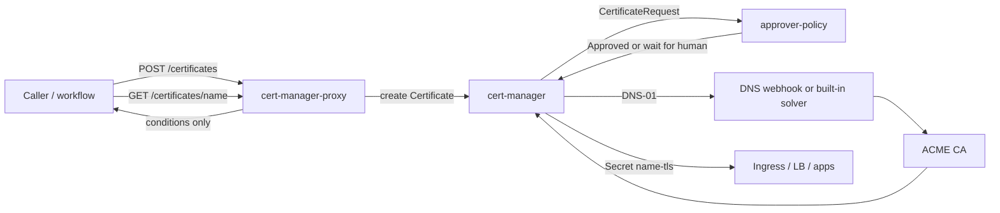
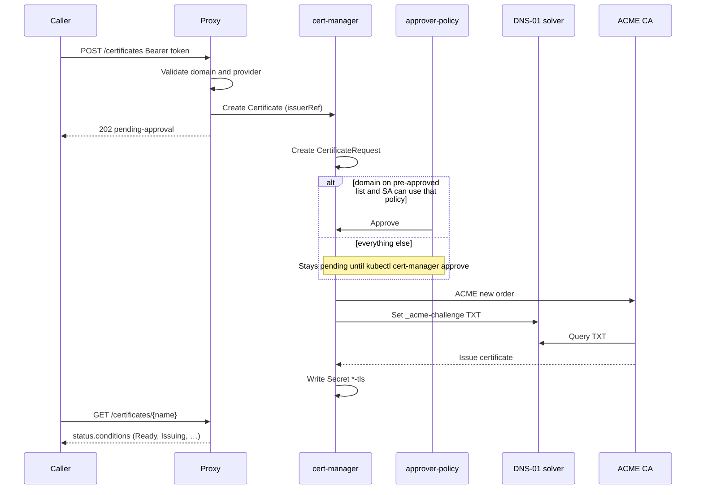
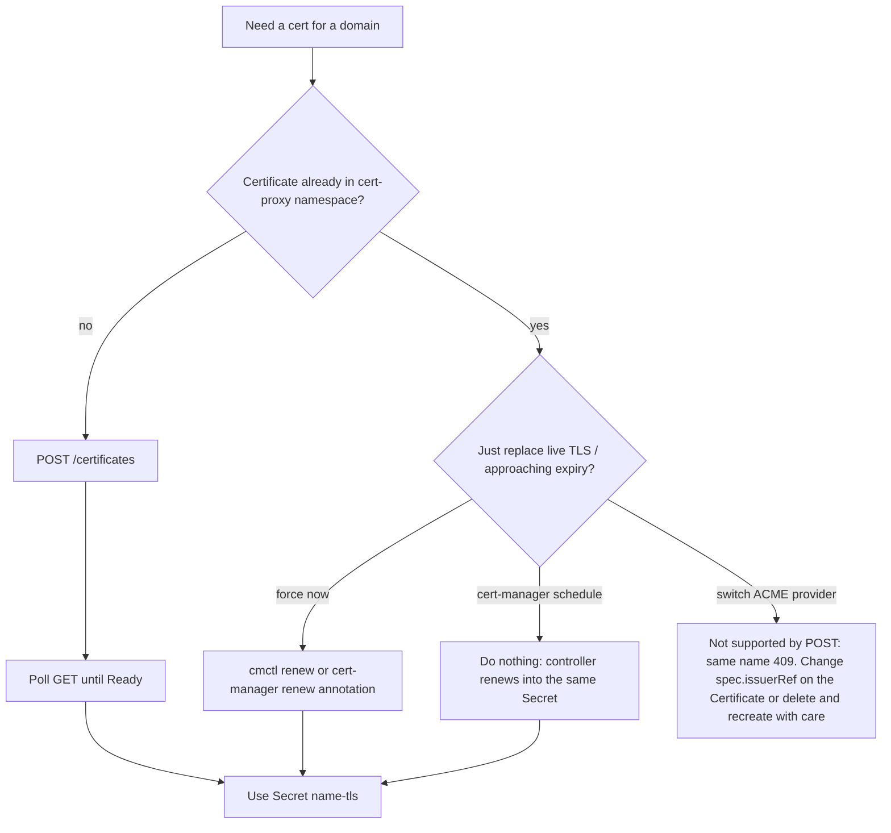

# Certificate obtain and rollover

This service is a thin HTTP intake in front of [cert-manager](https://cert-manager.io/). It does **not** talk to Let's Encrypt, ZeroSSL, or Entrust itself. It creates a cert-manager `Certificate` in Kubernetes; cert-manager and `approver-policy` do the rest (approval, ACME, DNS-01, secret material, and later renewal).

> Experimental. The chart and API have not been proven against a real cluster.

## What lives where

| Piece | Role |
| --- | --- |
| This Go API | Auth, validate `{domain, provider}`, create/get `Certificate` objects |
| Helm chart | Installs the API, cert-manager, `approver-policy`, `ClusterIssuer`s, and `CertificateRequestPolicy`s |
| `approver-policy` | Pre-approval gate. cert-manager will not start ACME until the `CertificateRequest` is `Approved` |
| cert-manager | ACME DNS-01, writes `tls.crt` / `tls.key` into a Secret, renews before expiry |
| Your DNS webhook | Implements DNS-01 for an internal/custom DNS API (or use a built-in solver: Route53, Cloudflare, …) |

The API's ServiceAccount can `create`/`get` `Certificate`s only. It cannot read the TLS Secret. Callers poll `GET /certificates/{name}` for conditions; operators (or another controller) consume `{name}-tls`.

## First issuance (obtain)

Out-of-band domain review happens **before** or **beside** this API, not inside it.

1. Put allowlisted names in `policies.preApprovedDomains.dnsNames` (Helm values), **or** leave them off the list so a human in `policies.manualReview.reviewerGroup` must `kubectl cert-manager approve`.
2. `POST /certificates` with `{"domain":"app.example.com","provider":"letsencrypt"}` and `Authorization: Bearer …`.
3. The proxy maps `provider` → `ClusterIssuer` name, sanitizes the domain into a Kubernetes object name (`app.example.com` → `app-example-com`, `*.example.com` → `wildcard-example-com`), and creates a `Certificate`.
4. Response is `202 Accepted` with `status: pending-approval`. A second POST for the same domain is `409 Conflict` — that object already exists; renewal is not a new POST (see [Rollover](#rollover-renewal)).
5. cert-manager creates a `CertificateRequest`. If the requestor's SA has `use` on `pre-approved-domains` **and** the DNS names match that policy, `approver-policy` auto-approves. Otherwise the request sits until a reviewer approves it.
6. After approval, cert-manager runs ACME DNS-01 against the issuer's solver, then writes Secret `app-example-com-tls`.
7. Point Ingress, a load balancer, or `kubectl get secret … -o jsonpath` at that Secret. That is how you **replace an existing SSL cert**: issue through this path, then swap the live material for the new Secret. The API does not import PEMs from elsewhere.





## Rollover (renewal)

Once a `Certificate` exists, **cert-manager owns rollover**. Default ACME certs are ~90 days; cert-manager renews at about **2/3 of the lifetime** (around 30 days before expiry) unless you set `spec.duration` / `spec.renewBefore` on the object (this API currently does not set those, so you get defaults).

Renewal reuses the same `Certificate`, issuer, and Secret name. A new `CertificateRequest` is created; approval still goes through `approver-policy`. For names that stay on `pre-approved-domains`, that is automatic. Names that only match `manual-review` need a human again unless you add them to the allowlist.

Do **not** POST again to renew. The name is derived from the domain, so Kubernetes will reject the create (`409` from this API).

Force a rotation (compromise, algorithm change, “issue now”):

```sh
# cert-manager CLI
cmctl renew app-example-com -n cert-proxy
```

Or annotate the `Certificate` as in [cert-manager renewal docs](https://cert-manager.io/docs/usage/certificate/#renewal). The Secret is updated in place; consumers that mount it pick up the new files after a reload/restart depending on how they watch Secrets.



## Provider names vs ClusterIssuers

The HTTP `provider` field is a short alias in Go (`internal/certrequest/certrequest.go`), not the Helm `issuers[].name`:

| `provider` in JSON | `ClusterIssuer` |
| --- | --- |
| `letsencrypt` | `letsencrypt-prod` |
| `zerossl` | `zerossl-prod` |

Helm `values-example.yaml` also templates an `entrust-prod` issuer. The API will reject `"provider":"entrust"` until that alias is added to the Go map. Adding a `ClusterIssuer` in values is not enough by itself.

## Approval RBAC (why `disableAutoApproval` exists)

The chart sets `cert-manager.disableAutoApproval: true`. Without that, cert-manager's built-in approver would approve every `CertificateRequest` and the policies would never gate issuance.

- Proxy SA: `use` on policy `pre-approved-domains` only.
- Reviewer group: `use` on policy `manual-review` (optional; off until you set a real SSO group).

## Migrating an existing (non–cert-manager) certificate

This stack always **issues a new** ACME certificate. It does not upload an existing PEM.

1. Confirm the name is allowlisted or that a reviewer will approve.
2. POST once; wait until `Ready`.
3. Copy or reference Secret `{sanitized-domain}-tls` in the place the old cert is installed.
4. Leave the `Certificate` in place so cert-manager keeps rolling it over.

Until the Secret is Ready, keep serving the old cert.

## Related files

- API: `cmd/cert-manager-proxy/main.go`, `internal/certrequest/certrequest.go`
- Chart: `charts/cert-manager-proxy/` (`values.yaml`, `values-example.yaml`, `templates/cluster-issuers.yaml`, `templates/policies.yaml`, `templates/rbac.yaml`)
